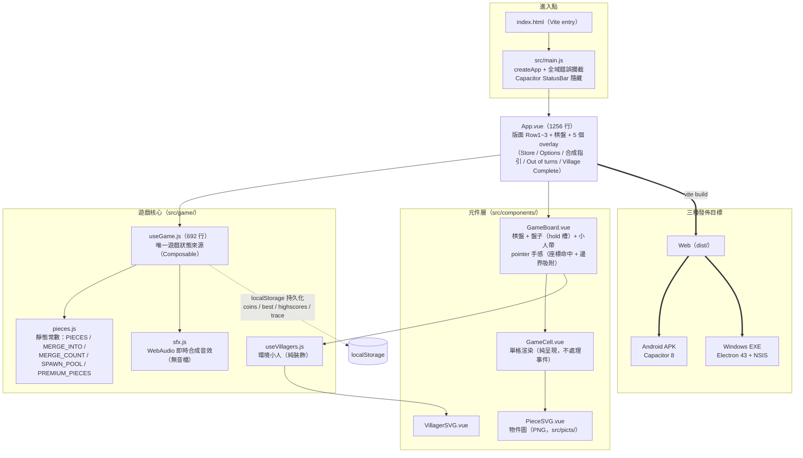
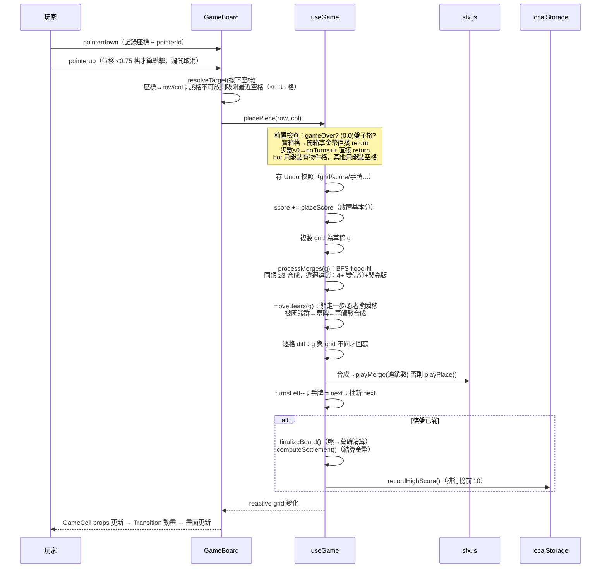
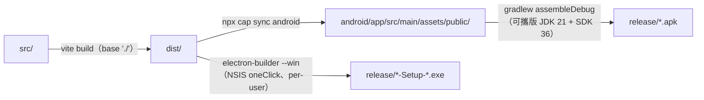

# SRD - Triple Town CL 系統架構（System Architecture）

*本文件依 AISDLC `SRD_Module_Template.md` 撰寫。*
*專案性質：純前端單機遊戲（無後端伺服器、無資料庫），範本中以「後端 / API / DB」為前提的章節將標註「不適用」並改述本專案的對應設計。*

---

## 1. 技術架構總覽 (Technical Overview)

### 架構圖



### 技術選型

| 層面 | 選型 | 理由（依程式碼與 CLAUDE.md 記載） |
|------|------|------|
| UI 框架 | Vue 3.4（`<script setup>` Composition API） | 響應式棋盤渲染；與 JournalCL 等專案技術棧一致，便於學習 |
| 建置工具 | Vite 5（`base: './'`） | 相對路徑是必要設定：Electron 以 `file://` 載入 `dist/index.html`，絕對路徑會找不到資源 |
| Android 打包 | Capacitor 8（`@capacitor/core`、`@capacitor/android`、`@capacitor/status-bar`） | 不需 Android Studio，配合可攜版 JDK 21 + Android SDK（`d:\ClaudeLab\android-dev\`） |
| Windows 打包 | Electron 43 + electron-builder 26（NSIS oneClick、per-user） | 產出雙擊安裝檔，自動建立桌面捷徑 |
| 音效 | WebAudio API 即時合成（`sfx.js`） | 零外部音檔，打包體積小；失敗時靜默跳過不影響遊戲 |
| 持久化 | `localStorage` | 單機遊戲，只需保存金幣 / 最高分 / 排行榜 / 除錯 trace |

依賴極簡原則：runtime 依賴僅 `vue` 與 3 個 Capacitor 套件，無狀態管理庫（Pinia/Vuex）、無路由——單頁遊戲由一個 Composable 管理全部狀態即足夠。

### 設計模式

- **Composable 狀態模式**：`useGame()` 是唯一的遊戲狀態來源（single source of truth），回傳 state（`grid`、`score`、`coins`…）與 action（`placePiece`、`swapPiece`、`buyItem`、`restart`）。App.vue 解構取用，元件間不各自持有遊戲狀態
- **Presentational Components**：`GameBoard` / `GameCell` / `PieceSVG` 只接收 props、發出 emit（`place`、`swap`），不含遊戲邏輯。`GameCell` 為純呈現元件，不綁事件
- **棋盤層級命中判定（board-level hit testing）**：pointer 事件統一綁在 `.board`，用 `getBoundingClientRect()` 把座標換算成 row/col，而非讓每格各自判斷是否被點到。這樣才有辦法在「點到不能放的格子」時往鄰近空格吸附（詳見下方「放置手感」）
- **靜態資料與邏輯分離**：`pieces.js` 只放常數表（物件定義、合成對照、機率池），不含任何狀態，調整遊戲平衡只需改這個檔
- **草稿盤（draft grid）模式**：每次落子先複製 `grid` 為普通陣列 `g`，所有合成 / 熊移動在 `g` 上完成後，逐格 diff 回寫 reactive `grid`——只有真正變化的格子觸發動畫

### 對應需求

此設計支援 [FRD_GameRules](../frd/FRD_GameRules.md) 定義的全部規則（合成鏈、放置判定、水晶橋接、熊 AI、抽牌機率、商店經濟、結算）。功能基準為手機版《Triple Town》原版行為（Standard Map），參考截圖存於 `art-reference/`。

---

## 2. API 設計 (API Specifications)

**本章不適用**：本專案為純前端單機遊戲，無 HTTP API、無後端伺服器。

以下改述對等物——`useGame()` Composable 的公開介面（App.vue 唯一的「服務端點」）：

### 回傳的 State（唯讀取用）

| 名稱 | 型別 | 說明 |
|------|------|------|
| `grid` | `reactive Array(6)(6)` | 棋盤；每格為物件字串（如 `'grass'`）或 `null`；`(0,0)` 保留給盤子 |
| `score` / `bestScore` | `ref(Number)` | 本局分數 / 歷史最高分（自動寫入 localStorage） |
| `coins` | `ref(Number)` | 金幣，跨局持久貨幣（localStorage） |
| `highScores` | `ref(Array)` | 完場排行榜，`{score, date}` 最多 10 筆 |
| `turnsLeft` / `turnsRegenSecs` / `turnsRegenProgress` | `ref` / `computed` | 剩餘步數（上限 150）、距回血秒數、回血進度 0-100 |
| `currentPiece` / `nextPiece` / `storedPiece` | `ref(String\|null)` | 手牌 / 下一張 / 盤子暫存 |
| `gameOver` / `goalReached` / `goalPercent` | `ref` / `computed` | 棋盤滿即結束；目標 300,000 分 |
| `parked` | `computed({cell, merge})` | 手牌智慧停放格：優先「放下就合成」的格子，否則上一步附近 |
| `mergedCells` / `premiumCells` | `reactive Set` | 本步被合成消耗的格子 / 高級版（4+ 合成）物件格 |
| `settlement` | `ref(Object\|null)` | 完場結算：`{total, rank, rankCoins, historyCoins, turnsUsed, items}` |
| `noTurns` | `ref(Number)` | 步數用光仍點擊的訊號（每次 +1，UI watch 後跳「Out of turns!」） |
| `storeQueue` / `canUndo` | `ref` | 商店購買佇列 / 是否有可悔棋快照 |
| `storeStock` | `reactive Object` | 各商品本局剩餘庫存（id → 剩餘數）；每局重置、局內不補貨，不限購商品不在表內 |

### 回傳的 Action

| 函式 | 參數 | 行為 |
|------|------|------|
| `placePiece(row, col)` | 格子座標 | 落子主流程（見第 3 章序列圖）；寶箱格改為開箱拿金幣、不耗步數 |
| `swapPiece()` | — | 手牌與盤子（hold 槽）交換；盤子空則存入並抽下一張 |
| `buyItem(item)` | `STORE_ITEMS` 成員 | 扣單價、有庫存商品庫存減 1；效果三種：`turns`（+200 步）、`pieces`（1 個物件插入出牌佇列立即上手）、`undo`（還原上一步快照，coins 不還原） |
| `restart()` | — | 重開一局（`init()`）；coins 為跨局貨幣不重置 |

---

## 3. 前後端交互流程 (Frontend-Backend Interaction Flow)

**「前後端」在本專案對應為「UI 元件層 ⇄ useGame 遊戲核心」**。

### 3.1 業務流程序列圖

#### 落子（placePiece）主流程



#### 放置手感（touch input tolerance）

手機實測回報「有時沒點到格子中心，物件就放不上去」。原因有二，兩者都在 `GameBoard.vue` 處理：

| 問題 | 原因 | 對策 |
|------|------|------|
| 點在兩格交界處失敗 | 事件由實際壓到的那一格接收；若該格已有物件（不可放）就靜靜忽略，玩家看不出被拒絕 | pointer 事件改綁 `.board`，用座標算出 row/col；若該格不可放，改找周圍 8 格中距離最近的**空格**，距離 ≤ `0.35 × 格寬` 就吸附過去 |
| 偶發整下點擊無反應 | `touch-action: manipulation` 仍保留捲動判定，Android WebView 可能把這一觸判成捲動並發出 `pointercancel`，`pointerup` 不再送達 | `.board` / `.cell` / `.piece-plate` 改 `touch-action: none`，並加 `-webkit-touch-callout: none` 擋長按選單；另補 `pointercancel` 重置狀態 |

其他相關規則：

- **吸附只吸到空格**：機器人（摧毀物件）與寶箱（開箱）是有後果的動作，一律要求精準點到，不做容錯（`isSnapTarget()` 比 `isPlaceable()` 更嚴格）
- **以按下座標判定**，不用放開座標：手指離開螢幕瞬間接觸面會偏移，用放開點反而更容易偏格
- **滑開取消門檻**改為 `0.75 × 格寬`（原為固定 24px）：固定像素在高解析度手機上過於敏感，手指自然的微幅滾動會被誤判成拖曳取消
- **多指防呆**：記錄 `pointerId`，第二根手指按下時忽略，避免兩指同時觸發兩次落子
- **`setPointerCapture()`（EXE / 滑鼠版必要）**：觸控有隱含捕獲，滑鼠沒有。若在棋盤上按下、拖到棋盤外才放開，`pointerup` 會送給外面的元素，上一點的 `pointerId` 永遠清不掉，棋盤從此點不動。按下時主動抓取 pointer 並加 `lostpointercapture` 保險，確保狀態一定會被重置

### 3.2 API 調用時序與依賴

改述為 **useGame 內部函式的呼叫依賴**：

1. **前置檢查階段**（`placePiece` 開頭）
   - 狀態檢查：`gameOver`、`(0,0)` 盤子格、寶箱格（`isOpenable`）、`turnsLeft <= 0`
   - 落點規則：`bot` 只能點有物件的格；其餘物件只能點空格
2. **核心處理**
   - `resolveCrystal()`：crystal 落子專用——以 crystal 為橋樑 union 四周同類連通群，多組可合成時取結果價值最高者；無效則變 `rock`
   - `processMerges()` → `floodFill()`（BFS）：遞迴連鎖合成
   - `moveBears()` → `floodFill()`：困住判定以「連通熊群」為單位，整群無空格才全體變墓碑
3. **後續處理**
   - 音效分流（`mergeChain > 0` ?）、`parked` computed 重算（手牌停放提示）、完場結算鏈：`finalizeBoard()` → `computeSettlement()` → `recordHighScore()`

**呼叫依賴關係**：
- `placePiece` → `processMerges` → `floodFill`（合成依賴連通搜尋）
- `moveBears` 必須在 `processMerges` **之後**執行（先合成、熊再動，與原版一致）
- `buyItem(undo)` 依賴 `placePiece` 開頭存下的 `undoState` 快照

### 3.3 前端狀態管理與同步

#### 狀態結構設計

不使用 Pinia/Vuex；全部狀態集中在 `useGame()` closure 內：

```javascript
// reactive：需要逐格追蹤的結構
const grid = reactive(createEmptyGrid())      // 6×6，null | pieceKey
const premiumCells = reactive(new Set())      // 高級版格子 index（r*6+c）
const mergedCells = reactive(new Set())
// ref：純量與可整體替換的值
const score = ref(0); const coins = ref(...); const turnsLeft = ref(150) // …等
// 非響應式（不需驅動 UI 的內部狀態）
let undoState = null; let mergeChain = 0; let regenAnchor = Date.now()
```

#### 狀態同步策略

- **初始載入**：`useGame()` 建構時從 localStorage 讀回 `coins` / `bestScore` / `highScores`（JSON parse 失敗 fallback 空陣列）
- **增量更新**：草稿盤 diff 回寫（見 1. 設計模式），避免全盤動畫重觸發
- **步數回血（牆上時鐘法）**：每 10 秒回 1 步。不用「每秒累加」而是記錄 `regenAnchor` 時間戳計算實際經過時間——手機切背景時 `setInterval` 被凍結，回前景後由 `visibilitychange` 事件觸發 `regenTick()` 一次補回
- **離線處理**：單機遊戲，無網路依賴

#### 快取策略

**不適用**（無 HTTP 請求）。唯一類似機制：`parked` 為 computed，依賴 `grid` / `currentPiece` / `lastPlaced` 自動快取重算。

### 3.4 異常處理與容錯機制

#### 網路異常處理

**不適用**（無網路請求）。

#### 業務異常處理

- **步數用光**：`noTurns` ref +1 → App.vue watch 跳「Out of turns!」視窗（仿原版；避免玩家誤認當機）
- **無效落點**：直接 `return`，不扣步數、無副作用
- **商店**：金幣不足 / 本局庫存售完 / 遊戲結束 / Undo 無快照 → `buyItem` 回傳 `false`，UI 以灰色（`cant-afford`）呈現；物件旁 ×N 為動態庫存數字（貼片蓋住圖上畫死的數字），售完顯示 x0
- **localStorage 寫入失敗**：`try/catch` 靜默略過，不影響遊戲

#### 用戶體驗保障（除錯機制，main.js）

APP 版曾發生畫面凍結問題，因此內建三層診斷（皆為事實存在的程式碼）：

1. **Crash overlay**：`window.onerror`、`unhandledrejection`、Vue `errorHandler` 全部導向畫面上的紅色錯誤框（點擊關閉），方便測試者截圖回報
2. **凍結追蹤（`tt_trace`）**：`placePiece` 進入時寫 `place-start|座標|時間` 到 localStorage，完成時寫 `idle`；下次啟動若讀到 `place-start` 開頭，代表上次凍結在邏輯中途，主動顯示提示
3. **音效容錯**：WebAudio 建立失敗 / 被瀏覽器 suspend 時靜默跳過（行動瀏覽器需使用者互動後 `resume()`）

### 3.5 效能優化交互

- **請求優化**：不適用（無請求）
- **渲染優化**：草稿盤 diff 回寫；`GameCell` 以 `:key="piece"` 控制 Transition 只在物件種類改變時重播動畫；環境小人上限 4 隻（`MAX_TOTAL`）避免過多 DOM 動畫

---

## 4. 資料模型 (Data Model)

**無資料庫**；持久化層為 `localStorage`，遊戲內資料模型為 `pieces.js` 的常數表。

### localStorage Keys

| Key | 型別 | 描述 |
|-----|------|------|
| `tripletown_coins` | Number 字串 | 金幣（跨局持久貨幣），`watch(coins)` 即時寫入 |
| `tripletown_best` | Number 字串 | 歷史最高分，超過時即時寫入 |
| `tripletown_highscores` | JSON 陣列 | 完場排行榜 `[{score, date}]`，依分數排序取前 10 |
| `tt_trace` | 字串 | 凍結診斷標記：`phase\|extra\|ISO時間` |

### 遊戲內常數表（pieces.js）

| 常數 | 結構 | 說明 |
|------|------|------|
| `PIECES` | `{key: {name, tier, score, placeScore?, coins?, isOpenable?, isEnemy?, isNinja?, isSpecial?, isBot?, article?}}` | 全部 18 種物件定義；`score`=合成得分、`placeScore`=放置基本分 |
| `MERGE_INTO` | `{key: key}` | 合成鏈：建築鏈 grass→…→triple_castle、墓碑鏈 tombstone→church→cathedral→treasure、石頭鏈 rock→mountain→treasure |
| `MERGE_COUNT` | `{key: Number}` | 例外合成數量（預設 3；Standard Map 無例外，目前空表） |
| `SPAWN_POOL` | `[{type, weight}]` | 抽牌加權：grass 44 / bush 20 / bear 13 / tree 10 / hut 5 / crystal 4 / bot 3 / ninja_bear 1（石頭不在池中，僅由 crystal 失敗產生） |
| `PREMIUM_PIECES` | `Set` | 有閃亮高級版美術的物件：bush / tree / hut / castle |

### useGame 內部結算表

| 常數 | 說明 |
|------|------|
| `SETTLE_COINS` | 完場各建築留存金幣（hut 5 … triple_castle 5000） |
| `VILLAGE_RANKS` | 村莊等級標籤（依場上最高階建築：Camp → Imperial City） |
| `BUILDING_TIER` | 村莊等級金幣計算用 tier 值（rankCoins = tier 總和 × 50） |

### 關聯關係 / 索引設計

不適用（無資料表）。格子定位以 `index = row * 6 + col` 作為 Set 的 key。

---

## 5. 系統整合 (System Integration)

### 內部整合

單一 SPA，模組間以 ES import 靜態連結；無跨模組事件匯流排。

### 外部整合

| 平台 | 整合點 | 細節 |
|------|--------|------|
| Android（Capacitor） | `capacitor.config.json` | appId `tw.hedy.tripletown`、webDir `dist`、SystemBars hidden |
| Android（StatusBar 外掛） | `main.js` | 原生層沉浸模式外，JS 層在 WebView 載入後與 `visibilitychange` 時再 `StatusBar.hide()` 一次（部分機型會被系統還原） |
| Windows（Electron） | `electron/main.cjs` | 470×940 直式視窗、`loadFile('dist/index.html')`、移除選單列 |

### 訊息佇列/事件

不適用。唯一的非同步機制：回血 `setInterval`（1 秒 tick）與小人散步 `setInterval`（1.6 秒 tick）。

---

## 6. 安全設計 (Security Design)

### 認證機制

不適用：單機遊戲、無帳號系統、無個資。

### 授權控制

不適用。

### 資料保護

- **Electron**：`contextIsolation: true`、未開 `nodeIntegration`（遊戲純前端不需 Node 能力）；electron-builder 預設關閉 RunAsNode fuse，打包版擋掉 `--remote-debugging-port` 等偵錯參數
- **Android**：`allowMixedContent: false`
- **localStorage**：僅存遊戲數值（金幣/分數），無敏感資料；玩家可自行改值，單機遊戲不設防（無排行榜上傳）

---

## 7. 效能設計 (Performance Design)

### 快取策略

無 HTTP 快取需求。computed（`parked`、`goalPercent`、`emptyCount`）由 Vue 依賴追蹤自動快取。

### 資料庫優化

不適用。演算法複雜度：棋盤固定 6×6=36 格，`floodFill`（BFS）最壞 O(36)，連鎖合成遞迴深度受合成鏈長度（9 階）限制，效能無虞。

### 負載平衡

不適用。

### 渲染效能（本專案實際的效能重點）

- 草稿盤 diff 回寫：一次落子只更新真正變化的格子，避免 36 格全部重播 Transition
- 音效即時合成（oscillator + gain envelope），無音檔載入延遲
- 圖片資源：30 張 PNG 由 Vite 打包進 `dist/assets/`（build 產物約 125KB JS + 圖片）

---

## 8. 部署架構 (Deployment Architecture)

### 環境配置

| 環境 | 啟動方式 | 說明 |
|------|---------|------|
| 開發 | `npm run dev` | Vite dev server，port 5173 |
| Web 正式 | `npm run build` → `dist/` | 靜態檔案，可部署任何 web server |
| Android | `npm run apk`（= `build-apk.cmd`） | 產出 `release/TripleTownCL-v1.0-debug.apk` |
| Windows | `npm run exe` | 產出 `release/TripleTownCL-Setup-1.0.0.exe`（NSIS） |

### 建置管線



- APK 與 EXE 產出統一放 `release/` 目錄（勿提交版控）
- Android 建置不需 Android Studio：可攜版工具在 `d:\ClaudeLab\android-dev\`（JDK 21 Temurin、SDK platforms;android-36、build-tools;36.0.0），`android/local.properties` 指向 SDK 位置（勿提交版控）
- `vite.config.js` 的 `base: './'` 為三平台共用的關鍵設定（Electron `file://` 載入必要；Capacitor 與 Web 不受影響）

### 容器化

不適用（桌面/行動單機應用）。

### 監控與日誌

無伺服器端監控；用戶端診斷機制見 3.4（crash overlay、`tt_trace`）。

---

## 9. 技術債與限制 (Technical Debt & Limitations)

- **無版本控制**：專案目錄不是 git repository，檔案刪改無法還原（建議 `git init`，見開發指引）
- **無自動化測試**：無單元測試/E2E；驗證靠手動試玩（測試 SOP 見開發指引第 4 章）
- **APK 僅 debug 簽章**：debug keystore 只供試玩分發；上架 Google Play 需另做 release keystore + `assembleRelease`
- **Android 圖示與啟動畫面**：仍為 Capacitor 預設圖示（Windows 版已用 `build/icon.png`）
- **版本號分散三處**：`package.json` `"version"`、`build-apk.cmd` 輸出檔名 `v1.0`、App.vue Options 視窗硬碼 `v1.0.0`——改版時需手動同步
- **`confirm()` 原生對話框**：重新開始/放棄遊戲用瀏覽器原生 `confirm()`，與遊戲美術風格不一致
- **畫面凍結問題（歷史）**：APK 版曾出現凍結，壓力測試證實遊戲邏輯無誤，目前以 crash overlay + `tt_trace` 追蹤機制監控中，root cause 未定論
- **物件美術**：與原版仍有差距（`art-reference/` 有原版截圖與 PSD 源檔可參考）
